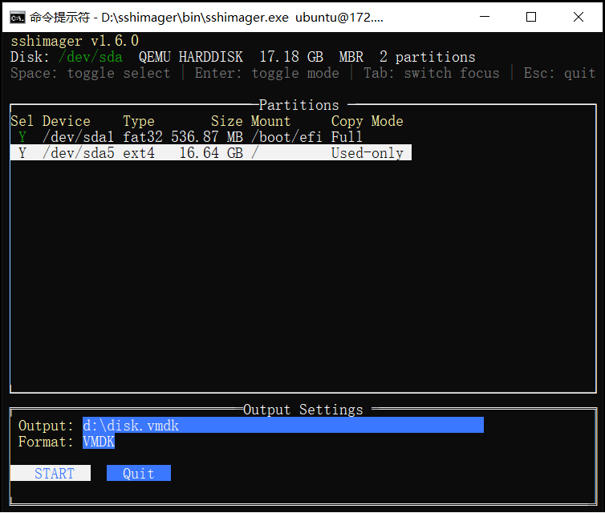

# sshimager

Remote Linux disk imaging over SSH. Creates VMDK/VHD/VDI/DD disk images from a remote Linux machine without installing anything on the target.



## Features

- **Zero installation on target** — only requires the remote machine's existing `sshd` and `sftp-server` (standard on virtually all Linux distributions)
- **Smart imaging** — used-only mode reads filesystem bitmaps (ext2/ext3/ext4, XFS, LVM) to skip free blocks, dramatically reducing image size and transfer time
- **Multiple output formats** — VMDK (VMware), VHD (Hyper-V), VDI (VirtualBox), DD (raw)
- **Sparse output** — all-zero regions are not written to disk, keeping image files compact
- **Non-root support** — automatically sets up `sudo sftp-server` when connected as a non-root user
- **Auto-reconnect** — network interruptions during transfer are handled automatically with unlimited retry (backoff 1s → 60s), no manual intervention needed
- **Interactive TUI** — terminal UI for disk selection and partition configuration, with mouse support
- **Cross-platform client** — runs on Windows and Linux (the client machine where images are saved)
- **LVM aware** — reads LVM physical volume layout, parses dmsetup table to map logical volumes, builds combined bitmap across all LVs
- **Swap handling** — swap partitions can be included (full copy for forensics) or excluded (used-only writes zeros)
- **Whole-disk filesystem** — supports disks without partition tables (e.g. `/dev/sda` formatted directly as ext4)

## Requirements

**Client (where you run the tool):**
- Windows or Linux (amd64)
- Network access to target via SSH

**Target (remote Linux machine being imaged):**
- SSH server (`sshd`) running
- `sftp-server` binary available (standard with OpenSSH)
- Root access, or a user with sudo privileges

No additional software needs to be installed on the target machine.

## Build

Requires Go 1.24+.

**Windows (builds both Windows and Linux binaries):**
```
build.bat
```

**Linux:**
```bash
go mod tidy
go build -trimpath -ldflags="-s -w" -o sshimager .
```

## Usage

### Interactive mode (recommended)

Connect to remote, select disk, configure partitions in TUI:
```bash
sshimager root@192.168.1.50 -i
```

Connect as non-root user (will use sudo automatically):
```bash
sshimager user@192.168.1.50 -i
```

### Specify disk directly

```bash
sshimager root@192.168.1.50:/dev/sda -i
```

### Full CLI mode

```bash
# Used-only for all supported partitions
sshimager root@192.168.1.50:/dev/sda -o server.vmdk --used-only-all

# Exclude partition 3, used-only for partitions 1 and 2
sshimager root@host:/dev/sda -o backup.vmdk --exclude 3 --used-only 1,2

# VHD format
sshimager root@host:/dev/sda -o server.vhd -f vhd --used-only-all

# Raw DD format
sshimager root@host:/dev/sda -o disk.dd --used-only-all
```

### Options

| Option | Description |
|---|---|
| `-o <file>` | Output file path (.vmdk, .vhd, .vdi, .dd) |
| `-f <format>` | Force output format: vmdk, vhd, vdi, dd |
| `-i` | Interactive mode with TUI |
| `--exclude <N,...>` | Exclude partition numbers (comma-separated) |
| `--used-only <N,...>` | Used-only mode for specific partitions |
| `--used-only-all` | Used-only mode for all supported partitions |
| `--buf-size <MB>` | I/O buffer size in MB (default: 8) |

## TUI Controls

### Disk selection screen
| Key | Action |
|---|---|
| Up/Down | Select disk |
| Enter | Confirm selection |
| Esc | Quit |

### Partition configuration screen
| Key | Action |
|---|---|
| Up/Down | Navigate partitions |
| Space | Toggle partition include/exclude |
| Enter | Toggle Full/Used-only mode |
| Tab | Switch focus (table, output, format, buttons) |
| Esc | Quit |

## How it works

1. **Connect** — establishes SSH connection to target, sets up SFTP (or sudo sftp-server for non-root)
2. **Discover** — lists available disks via `/sys/block/`
3. **Scan** — reads partition table (GPT/MBR), detects filesystems (ext2/3/4, XFS, swap, LVM)
4. **Configure** — interactive TUI or CLI flags to select partitions and copy modes
5. **Image** — reads disk data over SFTP, writes to local sparse virtual disk image
   - **Full mode**: sequential read of entire partition
   - **Used-only mode**: reads filesystem bitmap first (ext4 block bitmap, XFS bnobt free-space B+tree, LVM dmsetup mapping), copies only allocated blocks
6. **Auto-reconnect** — if SSH connection drops during transfer, automatically reconnects and resumes from the exact byte offset

## Supported filesystems for used-only mode

| Filesystem | Bitmap source |
|---|---|
| ext2/ext3/ext4 | Block group descriptor table, block allocation bitmap |
| XFS | AGF, bnobt (free-space-by-block B+tree) |
| LVM (ext4/XFS inside) | dmsetup table, PV offset mapping, per-LV bitmap |
| swap | Writes zeros (no data to copy) |

## Network resilience

During transfer, if the SSH connection drops:
- The tool automatically retries reconnection with exponential backoff (1s, 2s, 5s, 10s, 30s, 60s)
- Retries up to 9999 times (effectively unlimited)
- After reconnecting, resumes reading from the exact byte offset where it stopped
- Data from interrupted reads is discarded to prevent corruption
- No manual intervention required, leave it running unattended

## Example output

```
$ sshimager root@192.168.1.50 -i

SSH password: ********
Connecting to root@192.168.1.50:22 ...
Connected to root@192.168.1.50:22
Discovering remote disks...
Scanning partitions on /dev/sda...
Disk: /dev/sda  VMware Virtual S  21.47 GB  3 partitions
  #1  /dev/sda1     ext4    314.57 MB  /boot
  #2  /dev/sda2     ext4     19.01 GB  /
  #3  /dev/sda3     swap      2.15 GB  [SWAP]

Creating VMDK image: server.vmdk
  Copying gap/tail: 1.05 MB ...
  Partition #1 ext4 /boot: used-only 314.57 MB ...
    Bitmap: 55222/307200 blocks used (56.55 MB / 314.57 MB, block_size=1024)
  Partition #2 ext4 /: used-only 19.01 GB ...
    Bitmap: 744586/4641536 blocks used (3.05 GB / 19.01 GB, block_size=4096)
  Partition #3 swap [SWAP]: used-only -- writing zeros (sparse skip)

Done. 3.11 GB transferred in 95.3 seconds (33 MB/s)
Output set to read-only: server.vmdk
```

## License

Internal tool. Not for redistribution.
