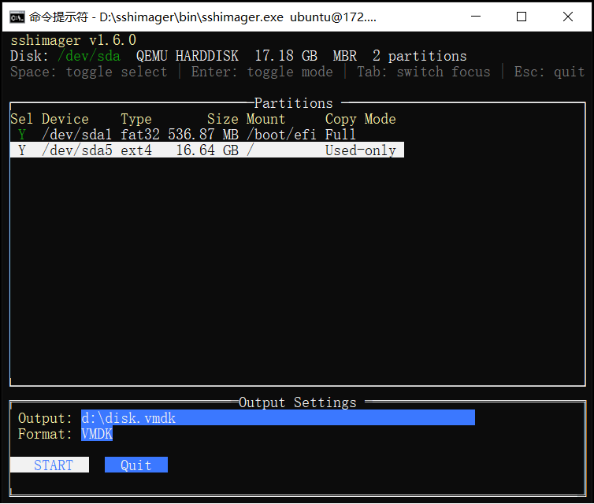

[English](README.md) | 简体中文

# sshimager

通过 SSH 对远程 Linux 磁盘进行镜像。无需在目标机器上安装任何软件，即可从远程 Linux 主机创建 VMDK、VHD、VDI 或 DD 磁盘镜像。



## 功能特性

- **目标端零安装** — 仅依赖远程机器已有的 `sshd` 和 `sftp-server`（几乎所有 Linux 发行版都默认提供）
- **智能镜像** — 仅复制已用空间模式会读取文件系统位图（ext2/ext3/ext4、XFS、LVM）并跳过空闲块，从而大幅减小镜像体积和传输时间
- **多种输出格式** — 支持 VMDK（VMware）、VHD（Hyper-V）、VDI（VirtualBox）和 DD（原始镜像）
- **稀疏输出** — 不向磁盘写入全零区域，使镜像文件保持紧凑
- **支持非 root 用户** — 以非 root 用户连接时自动配置 `sudo sftp-server`
- **自动重连** — 传输期间发生网络中断时自动处理，无限重试（退避时间从 1 秒逐步增加至 60 秒），无需人工干预
- **交互式 TUI** — 提供支持鼠标操作的终端界面，用于选择磁盘和配置分区
- **Windows 桌面 GUI** — 引导完成 SSH 连接、磁盘发现、分区策略设置和输出选择，并提供实时进度、日志与取消功能
- **Windows 任务栏进度** — 应用最小化后仍可查看镜像进度百分比以及重连或错误状态
- **跨平台客户端** — 支持在 Windows 和 Linux 上运行（即保存镜像的客户端机器）
- **支持 LVM** — 读取 LVM 物理卷布局，解析 dmsetup 表以映射逻辑卷，并根据所有逻辑卷构建组合位图
- **交换分区处理** — 可包含交换分区（完整复制，适用于取证），也可排除交换分区（仅复制已用空间时写入零）
- **整盘文件系统** — 支持没有分区表、直接格式化为 ext4 等文件系统的磁盘（例如 `/dev/sda`）

## 运行要求

**客户端（运行本工具的机器）：**

- Windows 或 Linux（amd64）
- 可通过 SSH 访问目标机器

**目标端（需要制作镜像的远程 Linux 机器）：**

- 已运行 SSH 服务器（`sshd`）
- 已安装 `sftp-server` 二进制文件（OpenSSH 的标准组件）
- 拥有 root 权限，或使用具备 sudo 权限的用户

无需在目标机器上安装其他软件。

## 构建

需要 Go 1.24 或更高版本。

**Windows（同时构建 Windows 和 Linux 二进制文件）：**

```
build.bat
```

Windows 版本使用 Wails v2，开发环境还需要安装 Node.js 和 Wails CLI。`build.bat` 会将桌面应用生成到 `build/bin/sshimager.exe`，将发行副本复制到 `bin/sshimager.exe`，为 Windows 自动化场景构建 `bin/sshimager-cli.exe`，并将 Linux agent 二进制文件放在两份 GUI 发行目录旁。

**Linux：**

```bash
go mod tidy
go build -trimpath -ldflags="-s -w" -o sshimager .
```

## 使用方法

### Windows 桌面界面

不带参数运行 `sshimager.exe`。界面将引导你完成：

1. SSH 连接及可选的 sudo 凭据配置
2. 远程物理磁盘选择
3. Agent/SFTP 传输方式及分区复制策略设置
4. VMDK/VHD/VDI/DD 输出选择
5. 查看实时进度、速度、预计剩余时间和重连状态，以及取消任务和处理结果

如需在 Windows 上进行自动化操作，请使用单独构建的 `sshimager-cli.exe` 及现有命令行参数。Linux 仍使用下文所述的 CLI/TUI 工作流。

### 交互模式（推荐）

连接远程机器，并在 TUI 中选择磁盘、配置分区：

```bash
sshimager root@192.168.1.50 -i
```

以非 root 用户连接（将自动使用 sudo）：

```bash
sshimager user@192.168.1.50 -i
```

### 直接指定磁盘

```bash
sshimager root@192.168.1.50:/dev/sda -i
```

### 完整命令行模式

```bash
# 对所有受支持的分区仅复制已用空间
sshimager root@192.168.1.50:/dev/sda -o server.vmdk --used-only-all

# 排除分区 3，仅复制分区 1 和 2 的已用空间
sshimager root@host:/dev/sda -o backup.vmdk --exclude 3 --used-only 1,2

# VHD 格式
sshimager root@host:/dev/sda -o server.vhd -f vhd --used-only-all

# 原始 DD 格式
sshimager root@host:/dev/sda -o disk.dd --used-only-all
```

### 选项

| 选项 | 说明 |
|---|---|
| `-o <file>` | 输出文件路径（.vmdk、.vhd、.vdi、.dd） |
| `-f <format>` | 强制指定输出格式：vmdk、vhd、vdi、dd |
| `-i` | 使用 TUI 交互模式 |
| `--exclude <N,...>` | 排除指定编号的分区（以逗号分隔） |
| `--used-only <N,...>` | 对指定分区仅复制已用空间 |
| `--used-only-all` | 对所有受支持的分区仅复制已用空间 |
| `--buf-size <MB>` | I/O 缓冲区大小，单位为 MB（默认值：8） |

## TUI 操作

### 磁盘选择界面

| 按键 | 操作 |
|---|---|
| 上/下方向键 | 选择磁盘 |
| Enter | 确认选择 |
| Esc | 退出 |

### 分区配置界面

| 按键 | 操作 |
|---|---|
| 上/下方向键 | 在分区之间移动 |
| Space | 切换是否包含该分区 |
| Enter | 切换完整复制/仅复制已用空间模式 |
| Tab | 切换焦点（表格、输出、格式、按钮） |
| Esc | 退出 |

## 工作原理

1. **连接** — 与目标端建立 SSH 连接并配置 SFTP（非 root 用户则使用 sudo sftp-server）
2. **发现** — 通过 `/sys/block/` 列出可用磁盘
3. **扫描** — 读取分区表（GPT/MBR），检测文件系统（ext2/3/4、XFS、swap、LVM）
4. **配置** — 使用交互式 TUI 或 CLI 参数选择分区及复制模式
5. **镜像** — 通过 SFTP 读取磁盘数据，并写入本地稀疏虚拟磁盘镜像
   - **完整模式**：顺序读取整个分区
   - **仅复制已用空间模式**：先读取文件系统位图（ext4 块位图、XFS bnobt 空闲空间 B+ 树、LVM dmsetup 映射），仅复制已分配的块
6. **自动重连** — 传输期间 SSH 连接断开时，自动重新连接并从中断处的准确字节偏移继续传输

## 仅复制已用空间模式支持的文件系统

| 文件系统 | 位图来源 |
|---|---|
| ext2/ext3/ext4 | 块组描述符表、块分配位图 |
| XFS | AGF、bnobt（按块索引空闲空间的 B+ 树） |
| LVM（内部为 ext4/XFS） | dmsetup 表、PV 偏移映射、各 LV 的位图 |
| swap | 写入零（无需复制数据） |

## 网络容错能力

传输期间如果 SSH 连接中断：

- 工具会采用指数退避策略自动尝试重新连接（1 秒、2 秒、5 秒、10 秒、30 秒、60 秒）
- 最多重试 9999 次（实际上相当于无限重试）
- 重新连接后，从中断处的准确字节偏移继续读取
- 丢弃中断读取所产生的数据，以防止损坏
- 无需人工干预，可让任务无人值守运行

## 输出示例

```
$ sshimager root@192.168.1.50 -i

SSH password: ********
Connecting to root@192.168.1.50:22 ...
Connected to root@192.168.1.50:22
Discovering remote disks...
Scanning partitions on /dev/sda...
Disk: /dev/sda  VMware Virtual S  21.47 GB  3 partitions
  #1  /dev/sda1     ext4    314.57 MB  /boot
  #2  /dev/sda2     ext4     19.01 GB  /
  #3  /dev/sda3     swap      2.15 GB  [SWAP]

Creating VMDK image: server.vmdk
  Copying gap/tail: 1.05 MB ...
  Partition #1 ext4 /boot: used-only 314.57 MB ...
    Bitmap: 55222/307200 blocks used (56.55 MB / 314.57 MB, block_size=1024)
  Partition #2 ext4 /: used-only 19.01 GB ...
    Bitmap: 744586/4641536 blocks used (3.05 GB / 19.01 GB, block_size=4096)
  Partition #3 swap [SWAP]: used-only -- writing zeros (sparse skip)

Done. 3.11 GB transferred in 95.3 seconds (33 MB/s)
Output set to read-only: server.vmdk
```

## 许可证

内部工具。禁止再分发。
